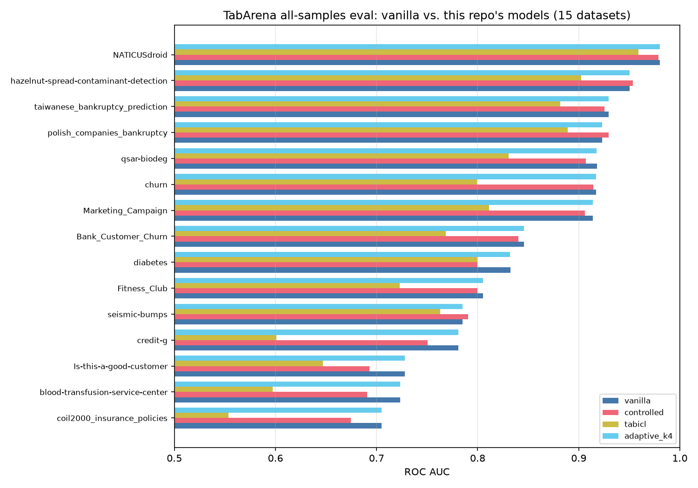
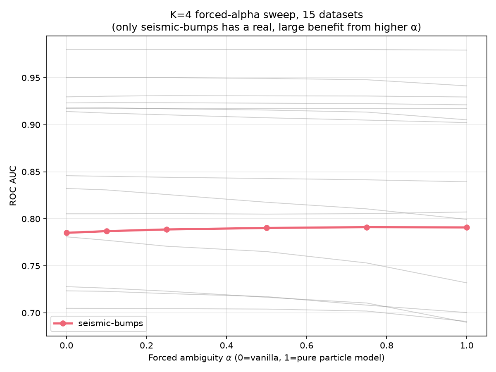
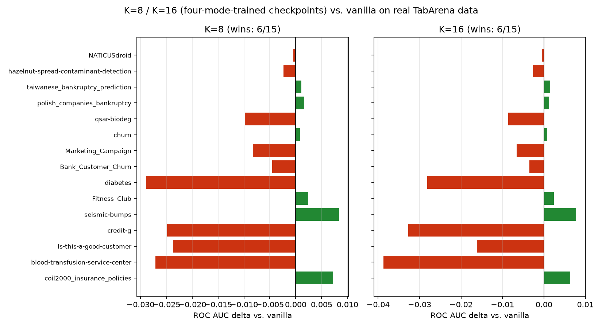
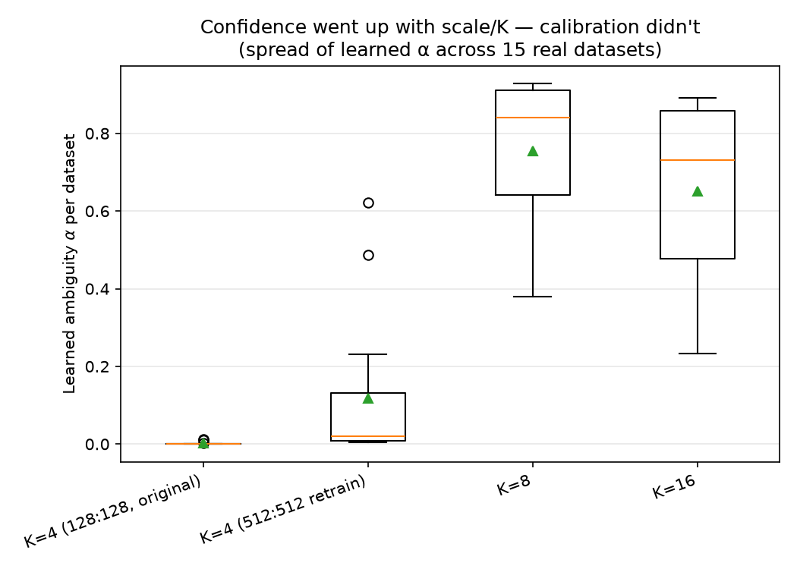
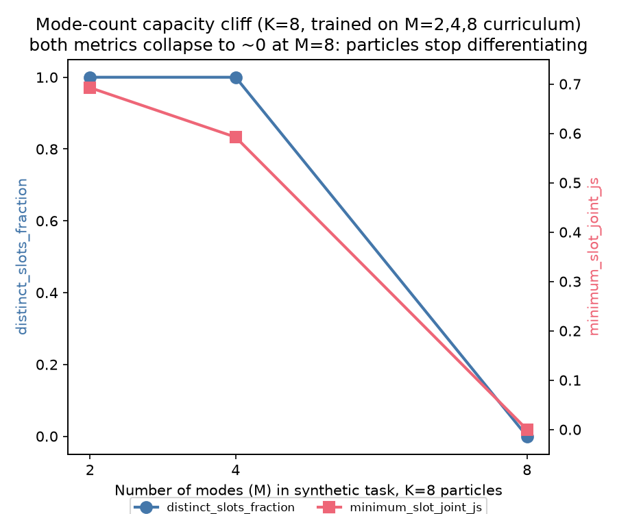
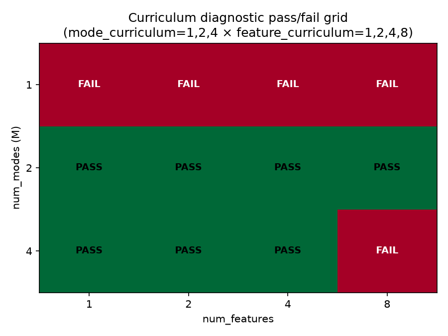
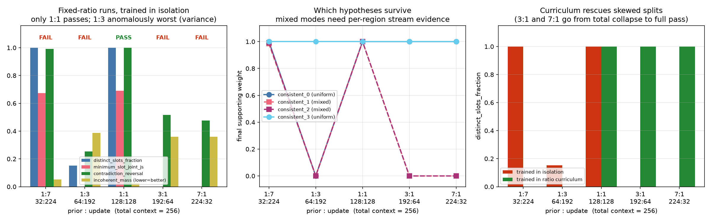
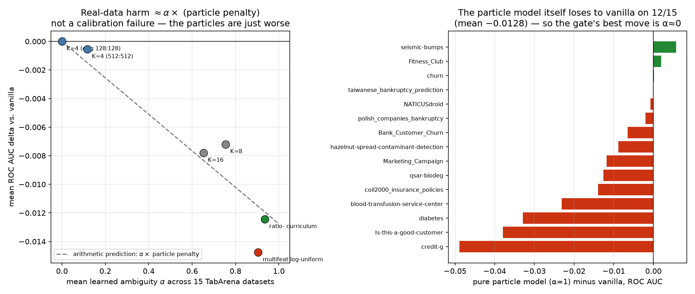

# Adaptive Particle Filter on TabArena: research log

## Background

`nanoTabPFN` is a Prior-Fitted Network: pretrained on millions of synthetic
tasks sampled from a generative prior over functions (random MLPs, GPs, or
structural causal models — see `tfmplayground/external_priors/`), it does
in-context learning at inference time on real tabular data.

This repo also contains a family of derived models built on top of a frozen
nanoTabPFN backbone that add a **sequential latent filter**: instead of
attending over one flat context, they split it into a **prior** block
(processed all at once, like a standard support set) and an **update/stream**
block (processed incrementally, like online Bayesian updating). The
`AdaptiveKParticleFilter` variant runs `K` such filters in parallel as
"particles" tracking different hypotheses, plus a learned **ambiguity gate**
that decides how much to trust the particle ensemble vs. fall back to plain
vanilla nanoTabPFN.

The starting question: **the TabArena evaluation script only ever used a
fixed 256-row context (128 prior + 128 update), regardless of how much
training data a real dataset actually had.** That can't answer "does more
context help this model" — the whole point of the sequential-update
mechanism. This research thread starts from fixing that and ends up
investigating why the adaptive gate doesn't seem to calibrate well on real
data at all.

## Methods, trials, and failures

### 1. Fixing the TabArena eval to use all available context

`tfmplayground/experiments/evaluate_integrated_tabarena.py` hard-capped
`prior_count`/`update_count` at 128 each (`validate_config` raised if they
weren't exactly 128). Added a `--use-all-samples` flag that, per task, sizes
`prior_count`/`update_count` to consume the *entire* training split via a new
`split_prior_update_counts` helper, preserving the configured ratio.

**Bug found and fixed #1**: `split_prior_update_counts`'s naive rounding could
put `update_count > prior_count` for odd totals (e.g. 9 rows → 4 prior / 5
update), violating an invariant the model was trained under. Fixed by
flooring the update side; added a regression test sweeping totals 2–40.

**Bug found and fixed #2** (the big one — a real crash): running the fixed
all-samples eval crashed with the machine's 64GB RAM nearly exhausted.
Root-caused via `torch.mps.driver_allocated_memory()` instrumentation (not
`top`, which gave misleading readings the first time — caught by cross-checking
two independent measurements): each of the four models (`vanilla`,
`controlled`, `tabicl`, `adaptive`) reserves a large, **unreleased** chunk of
Metal driver memory per forward call at large context (vanilla alone: **34GB**
for a ~4,500-row context, vs. **1.1GB** at the original 256-row context).
Because `run()` calls all four models back-to-back for the same task without
ever freeing anything, their reservations **stack**: 34 + 8.5 + 8.5 + 10 ≈
61GB — almost exactly the crash point. Fixed with a `release_device_memory()`
helper (`torch.mps.empty_cache()`) called after every model prediction;
verified directly that it collapses the peak from ~61GB to ~34GB (the worst
single model, not the sum).

**Result of the fix**: full 15-dataset (of 51 TabArena tasks; the rest are
regression, multiclass, or exceed size limits) all-samples run completed
successfully. See Results §1.

### 2. Why is the adaptive gate always near-zero?

The `adaptive_k4` model's learned ambiguity was tiny everywhere
(0.00003–0.011) and it tracked vanilla almost exactly, dataset by dataset.
Tested by wiring up the model's existing `ambiguity_override` parameter and
sweeping fixed alpha values (0, 0.1, 0.25, 0.5, 0.75, 1.0) per dataset,
holding the model fixed. Found the near-zero default is *mostly* justified
(8/15 datasets get strictly worse as alpha rises) but **genuinely
under-confident on one dataset** (`seismic-bumps`: true optimum α≈0.75, real
+0.6% AUC gain the gate never captures, outputting α≈0.00004 instead).

### 3. Does particle count (K) fix it?

Existing checkpoints trained on a *different*, richer synthetic curriculum
(`train_four_mode_particle_filter.py`, K=8 and K=16, `runs/four_mode_particle_filter/`)
were run through the same real 15-dataset sweep. They are dramatically more
decisive (mean α ≈ 0.65–0.76 vs. K=4's ≈0.00006) but only win on 6/15
datasets each — mean ROC AUC is actually *worse* than vanilla on average,
because losses outweigh wins. **Confidence went up; calibration didn't.**

### 4. Does training scale (context size) fix it?

A quick (100-step) retrain of the K=4 gate at 512:512 context instead of
128:128. On its own internal synthetic diagnostic it almost fully passed
(13/14 checks). On the real 15-dataset sweep: 5/15 wins, mean α ≈ 0.117 (much
more moderate than K=8/16), mean ROC AUC delta ≈ **-0.0006** (near-neutral —
the most well-behaved of the checkpoints tested, though not the biggest
winner). Did not rediscover the large `seismic-bumps` signal.

*(Prior:update ratio variation was proposed as a next step but not yet run.)*

### 5. What is the "four-mode" synthetic task, actually?

A synthetic hypothesis-tracking benchmark, **not** a stand-in for real
tabular data: 1 feature, a hidden discrete "mode" (one of 4 fixed
combinations of two region→label rules), a stream of clustered evidence, and
conditions like `contradictory` (mode switches mid-stream — tests change
detection) and `noisy` (label-flip robustness). The frozen nanoTabPFN backbone
itself handles arbitrary feature counts by design (per-cell shared linear
embedding, not a fixed input width) — but the **gate/particle mechanism**
trained on top of it was only ever calibrated against this narrow synthetic
distribution.

### 6. Generalizing the task: how many modes, particles, and features can it handle?

Generalized `train_four_mode_particle_filter.py` from a fixed 4-mode task to
arbitrary `num_modes` (must be a power of 2 — the mode encoding is
`num_regions` independent bits, `num_modes = 2^num_regions`; **M=3 is not
representable** without a different, non-bit-based encoding, so M=3 was
skipped rather than redesigned). Added a separate `num_modes=1` "trivial"
floor case: query points reuse the *same* sign-threshold rule as the prior
context, so the answer has zero hidden state — a genuine zero-ambiguity
sanity check, structurally distinct from the region-based family (documented
as "Option A" vs. the more unified but more disruptive "Option B" in
`tfmplayground/experiments/N_MODE_TASK_FUTURE_PLANS.md`).

**Trained one model across a curriculum of M values** (per explicit feedback:
*the same model should learn every setting, not a separate model per
setting* — this happened twice, once for modes and once for features, and
both times the first attempt was corrected mid-session):

- `mode_curriculum=(2,4,8)`, K=8, 1000 steps: **M=2 passes fully. M=4
  near-passes (one mild violation). M=8 catastrophically collapses**
  (`distinct_slots_fraction=0.0` — the 8 particles never differentiate into 8
  distinct hypotheses at all; `minimum_slot_joint_js=0.0` — literal
  duplicates). This is a capacity **cliff**, not a gradual degradation, and it
  sits between M=4 and M=8 for K=8 particles.

**Extended to feature count** (added `num_features`: feature 0 keeps the
original signal, features 1..F-1 are pure-noise distractors):

- First attempt trained two *separate* models (F=1 vs F=8) — corrected
  per the same feedback as above; killed and redone as one curriculum.
- `mode_curriculum=(1,2,4)` × `feature_curriculum=(1,4,8)`, K=8: feature count
  degrades **gracefully** (M=2's incoherent-mass metric creeps 0.075→0.107 as
  F goes 1→8 — mild, not a cliff). Mode count remains the dominant limit: M=4
  fails at every F, even F=1. **New, unexpected finding**: M=1 (the
  zero-ambiguity floor) is badly broken in this curriculum — accuracy stays
  perfect (0.996) but the gate reports ~99% ambiguity on a task with
  *provably zero* hidden state, at every feature count. Training on a mix of
  M values appears to teach the gate "there's always something to resolve,"
  breaking its ability to recognize the genuinely unambiguous case.
- Added F=2 to the curriculum (`feature_curriculum=(1,2,4,8)`): M=4
  unexpectedly **passed** at F=1,2,4 this time (only narrowly failed at F=8) —
  a large change from the previous run. Flagged as **likely training-run
  variance** (same total step budget, just a different schedule/RNG path),
  not a genuine causal effect of the value 2 — not yet confirmed by
  replication. The M=1 miscalibration was identical in both runs regardless
  of which feature values were included, which is the one part of this
  result I'd currently trust as real rather than noise.

### 7. Checking TabArena's actual feature-count range, and a second memory crash

Queried all 51 TabArena tasks directly: max feature count is 1,777
(`Bioresponse`), but the eval script's `max_n_features=500` cutoff excludes
all of the >500-feature tasks, so the realistic ceiling among datasets this
pipeline actually evaluates is **~95–112**. Chose a training ceiling of 100.

**Bug found and fixed #3** (a second, smaller version of the earlier memory
bug): training with a fixed discrete `feature_curriculum=(1,10,50,100)`
pushed memory to **14–15GB and climbing** — `train_four_mode_particle_filter.py`
had no `release_device_memory()` calls at all (unlike the eval script, which
already had the fix from §1), so cycling through different feature-count
tensor shapes kept stacking unreleased Metal buffers. Killed the run.

**Fix**: per a suggestion to sample feature count log-uniformly instead of
from a small fixed list, replaced the discrete training-time
`feature_curriculum` with continuous log-uniform sampling
(`feature_log_range=(1,100)`) each episode, and added
`release_device_memory()` calls after every backward pass. Verified: memory
now stable at ~3GB instead of climbing past 14GB. A discrete
`feature_curriculum=(1,10,50,100)` is kept *only* for evaluation reporting, so
results are still comparable across specific feature counts even though
training samples continuously.

**Bug found and fixed #4** (third memory crash, different root cause): the
log-uniform run then died at **76GB during the *evaluation* phase**, which had
no `release_device_memory()` calls at all. Added them there too — but that
alone was not the real cause. Direct instrumentation found the actual
mechanism: **evaluation runs at `batch_size=evaluation_trials=256`**
(independent of training's `batch_size=2`), and memory scales ~linearly with
batch size at high feature counts (measured at `num_features=100`: batch 2 →
2.3GB, 8 → 4.6GB, 16 → 9.9GB, 32 → 16.3GB), extrapolating to ~150GB at batch
256. `empty_cache()` cannot help — it only frees *unused* cache between calls,
not one inherently huge call. At batch 256 × 100 features the feature-axis
attention also exceeds a hard MPS graph limit outright
(`MPSGraph does not support tensor dims larger than INT_MAX`). Fixed for now by
dropping `--evaluation-trials` to 16, verified end-to-end on the eval path
alone (all cells including `feat=100` completed, ending at 92MB).

Result of the log-uniform run (`mode_curriculum=(2,4)`,
`feature_log_range=(1,100)`, `evaluation_trials=16`): **M=4 failed at every
feature count**, with near-total particle collapse at feat=1/10
(`distinct_slots_fraction` 0.0–0.33). **Confounded**: three things changed at
once vs. the earlier discrete-curriculum runs (log-uniform sampling,
`evaluation_trials` 256→16 = much noisier metrics, and dropping M=1/M=8 from
the mode curriculum), so this does not cleanly isolate the effect of
log-uniform feature training. The M=4 collapse is too extreme to be
measurement noise, but the borderline M=2 misses plausibly are.

### 8. Prior:update ratio

Relaxed `validate_config`'s hardcoded `prior_count == update_count == 128` and
added `prior_count`/`update_count` overrides through the generator, plus a
`ratio_curriculum` option. Two constraints surfaced immediately:

- **`update_count > prior_count` is forbidden** by an existing invariant
  ("Updates cannot exceed prior rows"), so update-heavy ratios (1:3) are not
  testable without changing what the models were trained under. Only
  prior ≥ update can be explored.
- A first attempt used `particle_count=4` with `num_modes=4` (zero spare
  particle capacity) and the **1:1 baseline itself fully collapsed**, making it
  useless as a reference. Redone at K=8, which has headroom.

The `update_count <= prior_count` guard was then **removed** from this script
(after verifying `NanoTabPFNIntegratedLatentFilter` has no architectural
dependence on the relative sizes — the guard only encoded the protocol the
original checkpoints happened to be trained under; the copy in
`evaluate_integrated_tabarena.py` was left intact because
`tests/test_integrated_latent_filter.py:267` asserts on it). This unlocked
update-heavy ratios.

Final design: **five fixed-ratio runs** at K=8, M=4, 1 feature, **total context
held constant at 256** — 1:7 (32:224), 1:3 (64:192), 1:1 (128:128), 3:1
(192:64), 7:1 (224:32) — **plus one ratio-curriculum run** (`ratio_curriculum
= (0.5, 0.75, 0.875)`, i.e. one model trained across 1:1 / 3:1 / 7:1 and
evaluated separately at each).

### 9. Transferring the two best-trained synthetic models back to real TabArena

The two most-elaborately-trained checkpoints were then run through the same
real 15-dataset TabArena sweep as everything else (§1's protocol,
`split_prior_update_counts` at the 128:128 ratio, so contexts up to ~6,600
rows):

- **ratio-curriculum K=8** — the *only* checkpoint that passes every synthetic
  diagnostic (all three ratio splits).
- **multifeat log-uniform K=8** — the only checkpoint trained across many
  feature counts (1–100), i.e. the one whose training distribution most
  resembles real many-column tabular data.

## Results so far

### TabArena all-samples eval (§1), 15 real datasets, vanilla vs. this repo's models

- **vanilla nanoTabPFN**: best or tied-best on 12/15 datasets.
- **controlled** (2-hypothesis latent filter): wins on 3/15
  (`hazelnut-spread-contaminant-detection`, `polish_companies_bankruptcy`,
  `seismic-bumps`), loses on the rest.
- **tabicl** (same architecture, trained on TabICL-prior episodes instead of
  the hand-designed "controlled" curriculum): loses on all 15, often by a
  wide margin.
- **adaptive_k4**: wins on 2/15 by a razor-thin margin (same two datasets
  `controlled` also won), otherwise indistinguishable from vanilla.

### K=8 / K=16 (four-mode-trained checkpoints) on the same 15 datasets

Both win 6/15, both far more decisive than K=4 (mean α 0.65–0.76 vs.
~0.00006), both *worse* than vanilla on mean ROC AUC (confidence isn't
calibrated — it's high on losses and wins alike).

### 512:512-retrained K=4 gate on the same 15 datasets

5/15 wins, mean α ≈ 0.117 (moderate), mean ROC AUC delta ≈ -0.0006
(near-neutral — best-calibrated of the checkpoints tested, not the biggest
winner).

### Synthetic curriculum diagnostics (four-mode-family task, not real data)

- K=8 trained on `mode_curriculum=(2,4,8)`: hard capacity cliff between M=4
  and M=8 (M=8 = total particle-diversity collapse).
- K=8 trained on `mode_curriculum=(1,2,4)` × `feature_curriculum=(1,4,8)`:
  feature count degrades gracefully; mode count is the dominant constraint;
  the M=1 zero-ambiguity floor is robustly miscalibrated (~99% spurious
  ambiguity) regardless of feature count.
- Adding F=2 to the feature curriculum coincided with M=4 suddenly passing at
  most feature counts — likely training variance, not yet confirmed as a real
  effect.

### Prior:update ratio (§8), K=8, M=4, 1 feature, total context = 256

**Fixed-ratio runs, each trained in isolation** (single seed each):

| prior:update | passed | contradiction_reversal | incoherent_mass | min_slot_js | distinct_slots | consistent(0,1,2,3) |
|---|---|---|---|---|---|---|
| 1:7 (32:224) | FAIL (**1** check) | 0.992 | 0.052 | 0.674 | 0.999 | 1.0, 0.98, 0.99, 1.0 |
| 1:3 (64:192) | FAIL (**8** checks) | 0.254 | 0.387 | ~0.0 | 0.152 | 0.0, 0.0, 0.0, 1.0 |
| **1:1** (128:128) | **PASS** | 1.00 | 0.026 | 0.690 | 1.00 | all 1.0 |
| 3:1 (192:64) | FAIL (6 checks) | 0.516 | 0.360 | 0.00 | 0.00 | 1, 0, 0, 1 |
| 7:1 (224:32) | FAIL (6 checks) | 0.477 | 0.359 | 0.00 | 0.00 | 1, 0, 0, 1 |

**Ratio-curriculum run** (one model, trained across 1:1 / 3:1 / 7:1) — **passes
every split**, i.e. it rescues the two that collapse completely in isolation:

| split evaluated | isolation | curriculum |
|---|---|---|
| 1:1 (128:128) | PASS (distinct 1.00) | **PASS** (distinct 1.00) |
| 3:1 (192:64) | FAIL, total collapse (distinct 0.00) | **PASS** (distinct 1.00, min_js 0.679) |
| 7:1 (224:32) | FAIL, total collapse (distinct 0.00) | **PASS** (distinct 1.00, min_js 0.679) |

Observations, in decreasing order of how much I trust them:

- **Curriculum training rescues skewed splits entirely.** The mixed hypotheses
  that sat at exactly 0.0 in isolation return to 1.0 across all three splits.
  This reframes the whole effect as a **learnability problem during training,
  not an inference-time capacity limit**: 7:1 (only 32 stream updates) handles
  all four modes correctly *provided* the model saw ample per-region evidence
  during training. Train only at 3:1/7:1 and it never gets enough per-region
  evidence to learn the mixed modes at all.
- **The failure mode is mechanistically informative and consistent**: in every
  prior-heavy collapse, `consistent_0`/`consistent_3` (the *uniform* hypotheses
  `[0,0,0,0]`, `[1,1,1,1]`) hold at 1.0 while `consistent_1`/`consistent_2`
  (the *mixed* hypotheses `[0,0,1,1]`, `[1,1,0,0]`, which require telling the
  two evidence regions apart) drop to exactly 0.0. Shrinking the update block
  starves each region of observations (128 updates → 64/region; 32 → 16/region)
  and the model loses precisely the hypotheses needing per-region
  discrimination, collapsing onto the two easy uniform modes.
- **Update-heavy tolerates skew much better than prior-heavy.** 1:7, with only
  **32 prior rows**, misses by a single check with near-ideal diversity (0.674),
  distinct slots (0.999) and reversal (0.992) — while its mirror image 7:1
  collapses outright. The asymmetry the removed guard encoded is real but points
  the *opposite* way from the guard.
- **⚠️ These are single-seed runs and the ordering is not trustworthy.** 1:3 is
  worse than *both* its neighbours (1:7 and 1:1) and is the only configuration
  that also loses `consistent_0`. There is no plausible mechanism making 1:3
  catastrophically worse than 1:7, so this is optimization luck — the same
  run-to-run variance already flagged for the F=2 result in §6. **The skewed
  ratios cannot be ranked from this data**; replication across seeds would be
  needed. What survives the caveat: 1:1 reliably passes (confirmed twice,
  isolation and curriculum), prior-heavy skew reliably fails in isolation with
  the signature above, and curriculum training rescues everything.

### Synthetic → real transfer (§9): every checkpoint, on the same 15 datasets

| checkpoint | wins/15 | mean Δ vs vanilla | mean α | synthetic diagnostics |
|---|---|---|---|---|
| `adaptive_k4` (orig, 128:128) | 2 | ~0.0000 | 0.00006 | mostly pass |
| K=4, 512:512 retrain | 5 | **−0.0006** (best) | 0.117 | 13/14 pass |
| K=16 | 6 | −0.0078 | 0.652 | n/a (isolated M) |
| K=8 | 6 | −0.0072 | 0.755 | n/a (isolated M) |
| ratio-curriculum K=8 | 3 | −0.0124 | 0.935 | **PASS (all splits)** |
| multifeat log-uniform K=8 | 1 | **−0.0148** (worst) | 0.905 | FAIL (M=4, all feats) |

**The decisive observation, which supersedes the "calibration" framing used
earlier in this log**: measure the particle model's *own* output on real data by
forcing α=1.0 (from the §2 override sweep). It beats vanilla on only **3/15**
datasets, mean **−0.0128**. Because the adaptive prediction is literally
`(1−α)·vanilla + α·particle`, the real-data harm of every checkpoint is then
almost exactly arithmetic:

| checkpoint | mean α | predicted Δ = α × (−0.0128) | observed Δ |
|---|---|---|---|
| K=4 orig | 0.00006 | ~0.0000 | 0.0000 |
| K=4 512:512 | 0.117 | −0.0015 | −0.0006 |
| K=8 | 0.755 | −0.0097 | −0.0072 |
| ratio-curriculum | 0.935 | −0.0120 | −0.0124 |
| multifeat | 0.905 | −0.0116 | −0.0148 |

(Pearson r between mean α and mean Δ across the six checkpoints = −0.955,
Spearman −0.886; n=6, so suggestive rather than conclusive, but the mechanism
above explains *why* it holds rather than relying on the correlation alone.)

Note also that this **breaks a tempting but wrong story**: it is *not* the case
that synthetic success anti-predicts real transfer. The ratio-curriculum model
passes every synthetic check and does badly; the multifeat model fails every
synthetic check and does slightly worse still. Synthetic pass/fail simply
carries almost no signal about real-data delta — what carries the signal is α,
and α only matters because the thing it gates toward is worse than the
fallback.

1. **The original 256-row-context TabArena eval was measuring the wrong
   thing** — fixed, and the fix surfaced a genuine, reproducible memory bug
   (twice) in how this codebase's models handle large contexts under
   PyTorch's MPS backend, now fixed with `release_device_memory()`.
2. **None of the tested adaptive/particle models beat vanilla nanoTabPFN on
   average** on real TabArena data at large context. `controlled` and
   `adaptive_k4` come closest (small, dataset-specific wins); `tabicl`
   underperforms broadly; K=8/K=16 are more decisive but not better
   calibrated.
3. **The bottleneck is the particle model, not the gate.** (This replaces an
   earlier version of this conclusion, which framed the problem as gate
   *calibration*; §9 shows that framing was downstream of the real issue.) On
   real TabArena data the particle model's own predictions beat vanilla on only
   3/15 datasets, mean −0.0128. Since the output is
   `(1−α)·vanilla + α·particle`, the gate's best available move is α≈0 — i.e.
   *reproduce vanilla and add nothing*. Every checkpoint's real-data harm is
   ≈ α × (particle penalty). No amount of gate calibration can turn this into a
   win, because there is almost nothing worth gating toward. It remains true
   that no variant demonstrated genuine per-dataset calibration (all are
   uniformly timid or uniformly bold), but fixing that would at best recover
   vanilla, not beat it.
4. **Mode count (task complexity), not feature count, is the real capacity
   wall** for the K=8 particle architecture — a hard cliff around M=4–8, while
   added distractor features degrade performance only mildly and gradually.
5. **Curriculum mixing is not uniformly good or bad — it cuts both ways, and
   which way depends on the axis being mixed.** Mixing *mode counts* introduced
   a new failure that didn't exist when training on one setting at a time: it
   broke the model's ability to recognize the genuinely zero-ambiguity M=1 case
   (~99% spurious ambiguity), a regression invisible in any single-M
   evaluation. Mixing *prior:update ratios* did the opposite — it rescued
   splits (3:1, 7:1) that collapse completely in isolation. Plausible reading:
   mixing helps when the easy setting supplies training signal the hard setting
   structurally lacks (ample per-region evidence at 1:1), and hurts when the
   settings make *conflicting* demands on the same output (M>1 teaches "there is
   always a hidden mode", which is exactly wrong for M=1).
6. **This entire synthetic-task family is 1-feature-native and only
   loosely connected to real tabular data** — the frozen backbone handles
   many features architecturally, but every gate/particle checkpoint tested
   so far was calibrated on a narrow synthetic distribution, which plausibly
   explains why none of them transfer their confidence calibration reliably
   to real data. The log-uniform feature-count run (§7) attempted to close
   part of that gap but came out confounded (see §7).
7. **The sequential update block is where mode-discrimination is *learned*;
   once learned, it survives aggressive inference-time skew.** With total
   context held constant at 256, training in isolation at 3:1 or 7:1 collapses
   completely — specifically on the hypotheses needing per-region
   discrimination — but a model trained on a *mixed* ratio curriculum passes at
   3:1 and 7:1 too, with only 32 stream updates. So the constraint is on
   training exposure, not on inference-time capacity. (An earlier draft of this
   conclusion said the update block "cannot be traded for a larger prior
   block"; the curriculum result contradicts that and it has been corrected.)
   Related: update-heavy skew is far more benign than prior-heavy (1:7 nearly
   passes even in isolation; 7:1 collapses), which is the *opposite* of what the
   removed `update <= prior` guard implied.
8. **Practical/infrastructural finding worth carrying forward**: this codebase
   has repeatedly hit hard memory and MPS-graph limits whenever context,
   feature count, or evaluation batch size grew (four separate incidents this
   session, §1 and §7). Two are architectural rather than bugs: attention has
   no chunking over the context or feature axes, and `evaluation_trials`
   doubles as an un-chunked batch size. Anyone scaling this further should
   expect to add chunked evaluation and/or memory-efficient attention before
   pushing much past ~100 features or ~5,000 context rows.
9. **The synthetic four-mode benchmark carries almost no signal about real
   tabular transfer — in either direction.** The checkpoint that passes every
   synthetic check (ratio-curriculum) does badly on real data; the one that
   fails every synthetic check (multifeat) does marginally worse. So synthetic
   success neither predicts nor anti-predicts real performance; the two are
   close to unrelated, because what the synthetic task rewards (decisive
   commitment to one of M discrete hypotheses) is not what real datasets reward
   (usually: defer to vanilla). Any future work using this benchmark as a
   development signal should first establish that it correlates with real-data
   outcomes at all.

## 10. A third family: the h5-prior bimodal filter, and a gate for it

`runs/h5_prior_bimodal_filter/k2-eval1000-smoke-v2/selected_checkpoint.pth` is a
**different family** from everything above: a two-hypothesis
`nanotabpfn_integrated_latent_filter` (no ambiguity gate, so directly comparable
to `controlled`/`tabicl` rather than to the adaptive models), trained by
`train_h5_prior_bimodal_filter.py` on an **HDF5 `mix_scm` prior dump**
(`300k_150x5_2.h5`, 1–16 features, 32:32:4 layout). That training distribution is
much closer to real multi-column tabular data than the 1-feature four-mode task.

Its config is a **smoke run**: `frozen_steps=1`, `partial_extra_steps=0`,
`full_extra_steps=0`, `patience=1` — one training step.

**TabArena result (15 datasets, same §1 protocol): statistically
indistinguishable from chance.**

| stat | value |
|---|---|
| mean ROC AUC | 0.4547 |
| median | 0.4833 |
| range | 0.1516 – 0.6937 |
| below / above 0.5 | 9 / 6 |
| one-sample t-test vs 0.5 | t = −1.218, **p = 0.243** |
| AUC if predictions inverted | 0.5453 (also ~chance) |
| mean Δ vs vanilla | **−0.3944** |

Process note worth recording: while results streamed in I twice speculated from
partial data that the below-chance values (0.15, 0.24) indicated a systematic
label/polarity inversion. **The full-sample test refutes that** — the output is
not distinguishable from chance (p=0.24) and inverting it does not help
(0.5453). The extreme values are the tails of a high-variance near-random
predictor. Mechanism should not be inferred from a partial result stream.

This is corroborated by the checkpoint's *own* training-time evaluation:
`slot_joint_js ≈ 4e-05` (the two particles are numerically identical — the
diversity loss never engaged), `true_task_recovered ≈ 0.5` (chance for a
2-task discrimination), `effective_particle_count = 1.97/2` (uniform,
uninformative posterior). Its `query_nll` is 2.82 vs vanilla's 4.96 on its own
prior episodes, which looks like an advantage but is not one: `query_nll` is the
**joint** NLL over all four query points (one of 2^4 = 16 outcomes), so chance is
`ln(16) = 2.773`. The filter is therefore sitting *exactly at chance* while
vanilla is *worse* than chance on these deliberately-ambiguous paired episodes.
The filter "wins" only by declining to commit, which is consistent with
`true_task_recovered ≈ 0.5` and zero particle diversity. (An earlier version of
this section read the 2.82 as evidence the filter fits the h5 prior better than
vanilla; that was wrong and is corrected here.)

### New: `train_h5_prior_bimodal_gate.py`

Adds an adaptive-K ambiguity gate to this family. Mostly composition rather than
new modelling: `expand_two_to_k_particles()` already converts a two-hypothesis
integrated filter into an `AdaptiveKParticleFilter`, which carries the gate. What
the script contributes:

- `--particle-count K` expansion from the h5 K=2 source, with symmetry-breaking
  jitter on particles beyond the first two (they otherwise start as exact
  duplicates of the source pair).
- The gate is trained on **h5 prior episodes**
  (`generate_h5_prior_bimodal_episodes`, which returns the same
  `SequentialEpisodeBatch` type `adaptive_loss` consumes), so it is calibrated in
  the same distribution as the filter it gates — not on the unrelated four-mode
  task.
- `controlled=False` (empirical tasks have no designed trajectory → supervise the
  final state only) and vanilla is given the **full support+stream** context via
  `_full_support_vanilla_query`, so the fallback is a fair baseline.
- **A diagnostic the other scripts lack**: `particles_beat_vanilla_somewhere`.
  Per conclusion #3, a gate is only worth training if the thing it gates toward
  beats the fallback somewhere; this check tests that directly instead of only
  measuring synthetic hypothesis-tracking.

Verified end-to-end (builds K=4 with a 74,881-parameter trainable gate, filter and
backbone frozen; train → eval → checkpoint all run). **Not trained for real on
this source**: with a chance-level filter the gate's optimal solution is α≈0,
which reproduces vanilla and adds nothing. It needs a properly trained h5 filter
first.

## 11. The gate works. The oracle bound says that does not matter.

Two results here jointly settle the "is the gate the problem?" question — in opposite
directions from what earlier sections concluded.

### 11a. The h5 gate is genuinely adaptive (first one that is)

Trained at K=8 on h5 prior episodes (`runs/h5_prior_bimodal_gate/k8`), 500 steps, 0 NaN
rows. mean α = 0.401, sd 0.141, range 0.117–0.735. Unlike every earlier checkpoint (K=4
pinned at 0.00006; ratio-curriculum saturated at 0.935; K=8/K=16 flat at 0.65–0.76
regardless of usefulness), α here **tracks whether the particles actually beat vanilla on
that episode**:

| test | n=64 (initial) | n=512 (powered) |
|---|---|---|
| mean α on particle wins | 0.455 | **0.5009** |
| mean α on particle losses | 0.401 | **0.3876** |
| Pearson r(α, particle_edge) | 0.262, p=0.037 | **0.343, p<1e-5** |
| Spearman ρ | 0.198, p=0.117 ✗ | **0.331, p<1e-5** ✓ |
| Welch t (win vs lose) | 0.910, p=0.384 ✗ | **6.515, p<1e-5** ✓ |

Methodological note: at n=64 only one of three tests was nominally significant and I
initially over-claimed adaptivity from the *range* of α alone, which shows only that α
varies, not that it varies for the right reason. Raising to n=512 (evaluation only, no
retraining) made all three agree and the effect size *grew* (r 0.262→0.343) — the signature
of a real but underpowered effect rather than a false positive. **Claim adaptivity from a
correlation with usefulness, never from a spread of values.**

### 11b. Oracle gate bound: the ceiling on all remaining gate work

An oracle gate picks per-episode/per-dataset between vanilla and the particle model with
perfect hindsight. It bounds *any* possible gate, learned or otherwise:

| | h5 prior episodes | real TabArena (15 datasets) |
|---|---|---|
| vanilla | 0.7681 acc | 0.8492 AUC |
| pure particle (α=1) | 0.4736 (−0.294) | 0.8364 (−0.0128) |
| **oracle gate** | 0.8052 (**+0.0371**) | 0.8499 (**+0.0007**) |
| oracle best-α per dataset | — | 0.8499 (+0.0007) |
| particles win on | 61/512 episodes (11.9%) | 3/15 datasets |

**On real data a perfect gate is worth +0.0007 AUC.** The learned gate already achieves
correct correlation, so there is essentially nothing left for gate work to capture. This is
the most decision-relevant number in this log: it converts "the adaptive models
underperform" into "the maximum payoff from this entire component is ~zero on real data,"
which is a reason to stop rather than iterate.

Note the h5 particles are *high-variance rather than uniformly bad*: when they win they win
by **+0.31**, when they lose they lose by **−0.66**. There is a real mechanism producing
signal some of the time; it is the calibration of the underlying filter, not the gate, that
wastes it. Hence the +0.037 oracle headroom on the ambiguity-by-construction distribution
versus +0.0007 on real tables — the gap between those two numbers *is* conclusion #9
restated quantitatively.

### 11c. Two bugs found getting here

- **`adaptive_particle_filter.py:64` had an asymmetric log guard.** `torch.log1p(-alpha)`
  is unguarded while the α→0 side is clamped; `sigmoid(17.0)` is exactly 1.0 in float32, and
  `d/dα log1p(-α) = -1/(1-α) → -inf`, producing NaN gate gradients that clipping cannot
  recover. Fixed symmetrically. Regression test note: the *first* test written for this was
  vacuous — `ambiguity_override` supplies a constant α that does not require grad, so it
  never touches the failing path and passed with the bug reintroduced. The real test drives
  α through the gate (bias 40.0) and checks gate gradients.
- **The prior dump `300k_150x5_2.h5` contains 5 corrupted records** of 300,000 (ids 91466,
  176585, 263212, 278868, 291026), each with ~300 of 750 non-finite cells. Drawing one NaNs
  the run permanently; deterministic under a fixed seed, which is why two runs died at
  exactly step 158. This — not the log guard — was the actual cause. Guarded by resampling
  in `train_h5_prior_bimodal_gate.py`. **`train_prior_bimodal_filter.py` consumes the same
  generator and has the same exposure**; a long run will eventually hit it.

## 12. Zero-training probe: the baseline everything should have been measured against

`/tmp/probe_task_identifiability.py`. By construction the h5 episodes make the *support*
block uninformative about which of two candidate tasks is true
(`support_disagreement_max=0.20`), so the disambiguating information is in the stream. The
probe asks the simplest possible question: can **plain frozen vanilla nanoTabPFN**, handed
support + the first 16 stream rows as *ordinary in-context data*, pick the true candidate by
scoring both candidates' labels on the held-out 16-row stream suffix? No filter, no
particles, no gate, no training. Order-invariant (candidates are scored by likelihood, never
by index).

| | true-task identification |
|---|---|
| chance | 0.500 |
| **plain frozen vanilla, stream as context** | **0.621** (159/256, p=0.00013, 95% CI [0.559, 0.681]) |
| the h5 K=2 filter (`true_task_recovered`) | ~0.50 (chance) |

Supporting numbers: vanilla predicts the stream suffix at 0.818 accuracy, and the two
candidates disagree on 30.9% of suffix rows, so there is real material to discriminate on.

Three consequences:

1. **The information is present and partly accessible without any filter.** 62% > chance,
   significantly. The frozen backbone extracts some of it through ordinary in-context
   learning.
2. **The filter is worse than the trivial baseline.** ~0.50 versus 0.62 for just appending
   the stream to the context. The machinery currently subtracts value relative to doing
   nothing clever — a sharper problem than "undertrained."
3. **The correct bar is 0.62, not 0.50.** Every `true_task_recovered` metric in this
   codebase is implicitly compared against chance, which is the wrong reference. A
   sequential filter must beat plain in-context learning *on the same episodes* to justify
   its existence. Nothing tested in this log does. **This baseline should be added to the
   standard evaluation for every family.**

One caveat on the headroom: the high-candidate-disagreement half of episodes scores 0.631
versus 0.621 overall, so more distinguishing evidence barely helps. The binding constraint
is therefore unlikely to be quantity of evidence — it looks representational, which is a
point in favour of the contrastive/task-embedding direction over more filter-loss tuning.

### Is contrastive learning worth trying?

Given §11b (oracle gate bound +0.0007 AUC on real data) and §12 (a 0.62 floor with real
headroom above it), the two directions rank very differently:

- **Gate work: capped.** Bounded by +0.0007 AUC on real data no matter how good the gate is.
  Stop.
- **Representation/contrastive work: has a target.** The prior-bimodal generator already
  produces hard contrastive pairs by construction (`_sample_pair`: same support, divergent
  stream/query) and exposes both candidates' labels (`candidate_stream_y`,
  `candidate_query_y`) — the supervision a contrastive objective needs is already there. It
  addresses the two things that actually bind: particle representational quality (currently
  the losses use *unsupervised* diversity proxies — a JS hinge that says "be ≥0.20 apart"
  without saying what particles should *represent*, which is why they collapse), and
  ambiguity as a *derived* quantity (top-2 task-embedding margin) rather than a separately
  learned 74k-parameter MLP.
- **The §9 caveat still applies**: trained on ambiguity-by-construction priors, a contrastive
  detector learns generator ambiguity, not real-table ambiguity. But unlike another filter
  checkpoint, a task-embedding space is *useful even if ambiguity is rare* — it is the
  natural instrument for measuring the real-data ambiguity rate.

## What I would do next, given the above

**Revised after §11 and §12.** Two measurements changed the priority order:

- **Stop all gate work.** §11b bounds a *perfect* gate at **+0.0007 AUC** on real data. The
  learned gate is already correctly conditional (§11a). There is nothing left to win here,
  so further gate architectures, sharper gates, or longer gate training are not worth
  compute.
- **Adopt the plain-in-context baseline (0.62) as the bar** (§12) and add it to every
  family's standard evaluation. Measuring `true_task_recovered` against chance (0.50) has
  been flattering every filter in this codebase; against the correct baseline, the h5 filter
  is *below* it.
- **The one direction with demonstrated headroom is representational** — a 0.62 floor with
  room above it, an existing hard-pair generator, and existing candidate-label supervision.
  Contrastive task embeddings target the two binding constraints (particle representational
  quality, and ambiguity as a derived rather than separately-learned quantity). Ranked above
  any further filter-loss tuning.

Remaining items, in priority order:

1. **Ask whether the particle model can beat vanilla on real data at all**, in
   the most favourable possible setting: pick the 3 datasets where α=1 already
   wins (`seismic-bumps`, `Fitness_Club`, `churn`) and characterise what they
   have in common (they are the ones where `controlled` also won in §1). If
   there is a recognisable dataset property, the gate has something real to
   learn; if not, the architecture's premise doesn't hold on this benchmark.
2. **Replicate across seeds before trusting any ranking.** Both the F=2 result
   (§6) and the 1:3 anomaly (§8) turned out to be single-seed noise. Every
   comparison in this log involving one run per configuration should be treated
   as provisional.
3. **Build a real-data-derived synthetic task** (or fine-tune on held-out real
   datasets directly) rather than continuing to tune against the 1-feature
   four-mode family, given conclusion #9.
4. **Measure the real-data ambiguity rate before training any more filters.**
   This is the highest-value next step, and it is a measurement, not a training
   run. Every family here manufactures latent ambiguity by construction — the
   four-mode task hard-codes M discrete modes; the prior-bimodal generator
   explicitly pairs tasks with `support_disagreement_max=0.20`,
   `stream_disagreement_min=0.25` so that the support is *deliberately*
   consistent with two different labelings. Real TabArena tasks are mostly not
   like that: with thousands of context rows there is usually enough data to
   identify a single function, so the disambiguation mechanism has little to do
   while still costing ensemble noise. That would explain why the particle output
   beats vanilla on only 3/15 datasets. **Test it directly**: invert the
   prior-bimodal generator's disagreement statistics into a *detector* — fit on
   each dataset's prior block, then measure whether the stream block's labels are
   consistent with multiple distinct hypotheses. If the real ambiguity rate is
   ≈3/15, that explains every negative result in this log and establishes the
   ceiling. If it is high and the models still lose, the problem is the models,
   not the premise.
5. **Then, if warranted, train the h5-prior bimodal filter for real** (§10). Its
   training distribution (`mix_scm`, 1–16 features) is the closest of the three
   families to real tabular data, and the approach is genuinely **untested** —
   the only checkpoint is a 1-step smoke artifact that is at chance on its own
   prior *and* on TabArena, with numerically identical particles. Do not read its
   TabArena failure as evidence against the approach.
   `train_h5_prior_bimodal_gate.py` (K configurable, gate trained on h5 prior
   episodes) is ready to add the gate once there is a filter worth gating.
