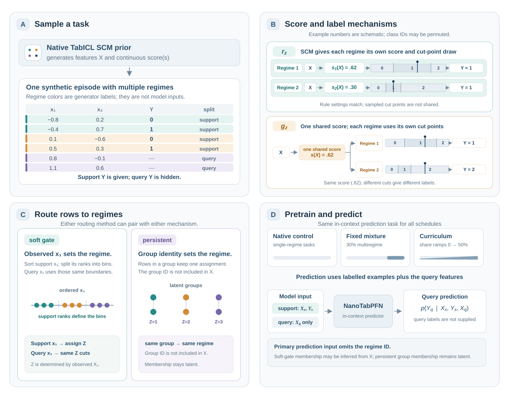
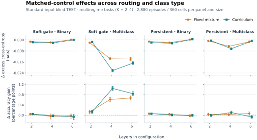

# Learning Heterogeneous Tabular Tasks through Multiregime Pretraining of Prior-Data Fitted Networks

## Abstract

Tabular datasets can combine observations from different populations, environments, or operating conditions, each governed by a different relationship between features and labels. These coexisting relationships define distinct regimes. Regime membership, however, may be unobserved, requiring classifiers to account for heterogeneity within a single dataset. Prior-data fitted networks (PFNs) are pretrained on synthetic datasets to predict new observations from labelled examples without task-specific retraining. We investigate whether incorporating regime heterogeneity into this pretraining enables compact PFNs to learn multiregime classification. We extend TabICL's structural-causal-model prior with regime-dependent score functions and label mappings, and compare fixed-mixture and curriculum pretraining with canonical NanoTabPFN pretrained on the matched single-regime prior, published tabular foundation models, and conventional classifiers. On held-out synthetic tasks with no explicit routing score, the largest effect occurs in feature-dependent, multiregime multiclass tasks: curriculum pretraining improves a six-layer NanoTabPFN's excess cross-entropy from −0.1562 to −0.1730 nats. Across 2,880 matched soft-gate episodes, the paired cross-entropy difference is −0.0168 nats (95% interval [−0.0179, −0.0158]) and the accuracy-gain difference is +0.84 points ([+0.76, +0.91]). Across all matched multiregime tasks with three to five classes, the curriculum model exceeds majority-class accuracy by 6.69 points, compared with 6.30 for canonical NanoTabPFN; its excess cross-entropy improves from −0.0838 to −0.0926 nats. Fixed-mixture pretraining produces a similar pooled improvement, so these experiments do not isolate an advantage of the curriculum schedule. Evaluation on 36 real-world BeyondArena tasks finds no consistent advantage over matched single-regime pretraining. These results show that compact PFNs can learn multiregime multiclass classification and that explicit multiregime pretraining helps on synthetic tasks, particularly with feature-dependent routing.

## Working outline

Working outline, updated 2026-09-25. Subsequent outline revisions should update this file in place.

Abstract result basis: the six-layer final-checkpoint synthetic results in Sections 5.1–5.2 and the 36-task BeyondArena comparison summarized in Section 6 and detailed in Appendix E. The abstract reports the curriculum variant; fixed-mixture results remain in the full comparisons.

Citation resources: [BibTeX bibliography](references.bib) and [literature/claim guide](literature_notes.md). Citation keys below use Pandoc syntax and can be reused in LaTeX.

Scope: native-prior NanoTabPFN experiments only, with published models and conventional methods retained as comparison baselines. The architecture is NanoTabPFN; “native” refers to TabICL's pretraining prior, not a different TabICL architecture. Non-native NanoTabPFN results are excluded.

Central argument: compact PFNs can learn multiregime multiclass tasks, and explicit multiregime pretraining improves prediction particularly under feature-dependent routing. These synthetic improvements do not establish a consistent real-world advantage over matched native single-regime pretraining.

### Submission constraints and page budget

Apply the supplied conference rules: the submission main text must not exceed **nine pages**; the discussion/rebuttal and camera-ready limit is **ten pages**. References do not count toward the limit. Appendices may be unlimited but must follow the bibliography, and reviewers are not required to read them. Do not rely on the later ten-page allowance for the initial submission.

Budget the title, abstract, text, equations, tables, figures, and captions within the nine-page submission limit. Target **8.5 pages of planned content**, retaining **0.5 page for layout variation**:

| Component | Target pages |
|---|---:|
| Title and abstract | 0.75 |
| 1. Introduction | 1.00 |
| 2. Background and related work | 0.50 |
| 3. Native-prior multiregime method | 1.50 |
| 4. Experimental setup | 0.75 |
| 5. Synthetic results | 2.50 |
| 6. Discussion and limitations, including transfer summary | 1.25 |
| 7. Conclusion | 0.25 |
| Planned content subtotal | **8.50** |
| Layout buffer | **0.50** |
| Submission maximum | **9.00** |

These are drafting targets, not a verified PDF page count. Check the compiled manuscript in the conference template, including float placement, before submission. The working notes, page-budget table, source pointers, and planning instructions in this file are not manuscript content.

**Main-text evidence rule:** a reviewer should understand the contribution and its limits without opening the appendices. Keep the prior definition, matched single-regime control, routing conditions and training-mixture schedule, evaluation/task counts, metric definitions, canonical and published synthetic comparisons, synthetic gains, a quantitative summary of neutral real-world transfer, and the single-seed caveat in the main text. Put detailed real-world comparisons in Appendix E.

**Display budget:** plan two figures and one compact main-text table. Figure 1 explains the prior and routing. Figure 2 summarizes final-checkpoint synthetic effects by routing, class type, and model size; do not include the full checkpoint grid. Table 1 contains matched synthetic headline comparisons. Appendix Table A1 contains BeyondArena overall and split-specific comparisons. If space is tight, combine Table 1 with Figure 2 before removing essential comparisons. The detailed plots remain attached in the appendices below, and the compact main-text figures are embedded in Sections 3 and 5.

Use compact paragraphs or run-in headings in the manuscript, especially in Sections 2, 5, and 6. The finer subsections below are drafting guides, not a requirement to typeset every subheading.

## 1. Introduction

Target: **1.00 page**. Preserve the population/environment/operating-condition background and the accessible PFN explanation, then state the research questions and bounded contribution.

Open with the abstract's motivation: tabular datasets can combine observations from different populations, environments, or operating conditions, each governed by a different relationship between features and labels. These coexisting relationships define distinct regimes. Regime membership, however, may be unobserved, requiring classifiers to account for heterogeneity within a single dataset. Relate this framing to conditional-mixture models, without assuming that every observed population or group has a different label mechanism. [@jacobs1991experts; @jordan1994hierarchical]

Introduce PFNs in accessible terms: they are pretrained on synthetic datasets to predict new observations from labelled examples without task-specific retraining. Explain that the pretraining prior specifies the kinds of feature–label relationships and task variation the model encounters. This motivates asking whether explicitly including coexisting prediction mechanisms in that prior improves learning of heterogeneous tasks. [@muller2022pfn; @hollmann2023tabpfn; @qu2025tabicl]

- Frame the study around **within-dataset heterogeneity** first, then introduce generalization across groups or environments as a separate transfer question. Use tabular shift benchmarks to motivate the latter, rather than treating grouped evaluation as direct evidence of latent regimes. [@gardner2023tableshift; @purucker2026beyondarena]
- Present two primary research questions:
  1. Can compact PFNs learn multiregime classification?
  2. Does multiregime pretraining improve over matched single-regime pretraining?
- Present real-world transfer as a secondary evaluation of whether the synthetic improvement extends to benchmark datasets.
- Preview the controlled comparison: extend the native TabICL prior with regime-dependent score functions and label mappings, retain its single-regime form as the canonical control, and evaluate fixed-mixture and curriculum pretraining in NanoTabPFN alongside published and conventional baselines.
- Summarize the main finding: multiregime pretraining improves synthetic multiclass prediction, particularly under feature-dependent routing, but provides little consistent additional benefit on BeyondArena.

## 2. Background and Related Work

Target: **0.50 page**. Compress the four topics below into a connected discussion, prioritizing PFNs, the native TabICL prior, and the closest mixture-learning work. Avoid repeating the introduction or giving a separate mini-survey for each model. Retain the essential novelty distinctions in the main text; the literature guide holds the longer reading list.

### 2.1 Prior-data fitted networks

Introduce synthetic pretraining, in-context prediction, NanoTabPFN, and published TabPFN and TabICL models.

Cite the foundational PFN formulation [@muller2022pfn], TabPFN's original and v2-generation papers [@hollmann2023tabpfn; @hollmann2025tabpfn], the lightweight NanoTabPFN implementation [@pfefferle2025nanotabpfn], and TabICL [@qu2025tabicl]. Use the release-specific TabICLv2 and TabPFN-3 references for those comparators. [@qu2026tabiclv2; @grinsztajn2026tabpfn3]

### 2.2 Heterogeneous tabular prediction

Develop the introduction's population/environment/operating-condition motivation into a discussion of latent subpopulations, mixture models, and varying feature–label relationships. Explain how a predictor must account for coexisting relationships when regime membership is not supplied. Distinguish within-dataset heterogeneity from generalization to unseen groups, and avoid assuming that observed group labels exactly identify prediction regimes.

Relate regime-dependent prediction to classical conditional mixtures [@jacobs1991experts; @jordan1994hierarchical], without describing our predictor as an architectural mixture of experts. Use TableShift and BeyondArena for the separate motivation of tabular distribution shift. [@gardner2023tableshift; @purucker2026beyondarena]

### 2.3 Synthetic prior design

Explain how pretraining task distributions encode assumptions about label relationships, class imbalance, and regime structure.

Ground prior-based task generation in PFN and TabICL work [@muller2022pfn; @qu2025tabicl]. Distinguish our extension of the native prior from the broader generation changes introduced in TabICLv2. [@qu2026tabiclv2]

### 2.4 In-context learning of mixtures

Discuss transformer learning of regression mixtures [@pathak2024mixtures; @jin2025mixtures] and the related Bayesian interpretation of in-context inference [@xie2022implicit]. Position our contribution as an empirical study of nonlinear multiclass tabular mixtures and matched prior design, not the first demonstration of mixture learning or a general learnability theorem. Explain why guarantees for linear regression mixtures do not automatically extend to this setting.

## 3. Multiregime Extensions of the Native TabICL Prior

Target: **1.50 pages**, including conceptual Figure 1. Give enough notation and generator description to make the comparison understandable; put full sampling distributions and implementation-level validation in Appendix A.

### 3.1 Problem formulation

Define support/query prediction, latent regime membership, regime-dependent label mechanisms, and the information available to the predictor.

### 3.2 Native single-regime control

Describe TabICL's native SCM sampling and `Reg2Cls` label generation. Establish this prior as the matched control for all multiregime comparisons.

Cite TabICL [@qu2025tabicl] and record the exact source-code revision for implementation-level behavior.

### 3.3 Multiregime mechanisms

- **$r_z$:** The SCM emits one score column per regime, and the active regime selects its column. Each score gets a separate draw of TabICL's class cut points; the cut-point settings are shared, but the cut points themselves are not.
- **$g_z$:** All regimes share one SCM score, then apply separate score-to-label mappings. The same score can therefore receive different class labels in different regimes.
- **$rg_z$:** Pretraining mixes both mechanisms.

### 3.4 Routing and pretraining schedules

Describe feature-dependent soft-gate routing and latent persistent routing. With soft-gate routing, observed x₁ determines the regime using cut points based on support-set ranks. With persistent routing, rows receive a stable latent group assignment; the group ID is not supplied as a separate model input.

Compare native single-regime pretraining against:

- Fixed multiregime mixing at 30%.
- Curriculum mixing increasing to 50%.

Use conditional-mixture literature for gating terminology [@jacobs1991experts; @jordan1994hierarchical] and curriculum learning for schedule context [@bengio2009curriculum]. Neither establishes the effectiveness of our particular prior or schedule.

*Figure 1. The three-class bar illustrates TabICL's label step: sampled cut points divide a score into ranges, and the range selects a class (class IDs may be permuted). In $r_z$, the SCM emits a separate score column for each regime; each column gets its own cut-point draw. The cut-point settings match across regimes, but the sampled cut points are not shared. In $g_z$, every regime uses the same SCM score, but applies its own cut points, so the same score can produce different labels. Either mechanism can use soft-gate routing, where observed x₁ determines the regime from support-set rank cut points, or persistent routing, where a latent group assignment stays fixed. In the primary prediction setup, the model receives labelled support examples and query features, but not the regime ID. We compare native single-regime pretraining with a fixed 30% multiregime mixture and a curriculum that increases the multiregime share from 0% to 50%.*

Manuscript export and editable source: [PDF](figure1_native_multiregime.pdf), [SVG](figure1_native_multiregime.svg), [build_figure1.py](build_figure1.py). The existing detailed empirical figures are preserved in Appendices C–E.

## 4. Experimental Setup

Target: **0.75 page**. Keep the controls, three architecture sizes, final-checkpoint reporting policy, primary synthetic evaluation, task counts, baselines, and metric definitions here. Put full hyperparameter, checkpoint, preprocessing, and task/fold inventories in Appendices B and E.

### 4.1 Architectures and training controls

Evaluate two-, four-, and six-layer NanoTabPFN variants. Specify matched initialization, training conditions, validation procedures, and checkpoint selection. Describe all architecture settings that vary across sizes, so the comparison is not presented as a depth-only ablation.

Cite NanoTabPFN [@pfefferle2025nanotabpfn] and document the implementation revision and local changes.

### 4.2 Synthetic evaluation

Vary regime count, class count, binary class imbalance, support size, feature count, and routing family. Include single-rule and shared-rule controls. Compare models on identical native-bank episodes, with episode-weighted aggregation.

### 4.3 BeyondArena evaluation

Introduce the selected 36-task BeyondArena evaluation subset (27 binary and nine multiclass tasks) as a secondary transfer check [@purucker2026beyondarena]. State that results use official folds and equal task weighting; put split counts, preprocessing, context construction, and ranking conventions in Appendix E.

### 4.4 Baselines and metrics

Compare against published TabPFN/TabICL models and conventional classifiers.

Cite the corresponding model papers from Section 2.1; add the official model card for TabPFN v2.6 release provenance [@priorlabs2026tabpfn26]. Record exact checkpoint and package versions separately. Cite random forests [@breiman2001forests], XGBoost [@chen2016xgboost], LightGBM [@ke2017lightgbm], CatBoost [@prokhorenkova2018catboost], and scikit-learn for the relevant implementations [@pedregosa2011sklearn].

Report accuracy gain over majority prediction, excess cross-entropy relative to the support-class-frequency predictor, and macro one-versus-rest AUC. Express accuracy gains in percentage points and cross-entropy in nats.

Use proper scoring rules as background for cross-entropy [@gneiting2007scoring]. Do not describe lower cross-entropy alone as proof of better calibration. Dataset-level rank summaries are descriptive unless a statistical comparison is explicitly performed. [@demsar2006comparisons]

## 5. Synthetic Results

Target: **2.50 pages**, including the compact final-checkpoint Figure 2 and Table 1. Establish that the native single-regime control already learns some multiregime tasks, then prioritize the matched pretraining effect, routing dependence, and published baselines. State that gains are modest and concentrated in feature-dependent multiclass tasks. Keep capacity and scheduling findings concise; move checkpoint trajectories and exploratory regime analyses to Appendices C and D.

### 5.1 Primary synthetic result: feature-dependent multiclass routing

Lead with the six-layer **soft-gate multiregime-multiclass** result on the primary synthetic evaluation—the main synthetic achievement—before presenting the pooled result. Its excess CE improves from **−0.1562 to −0.1730**.

- On the matched soft-gate multiregime-multiclass subset, curriculum changes cross-entropy by **−0.0168 nats** (95% interval **[−0.0179, −0.0158]**) and accuracy gain by **+0.84 points** (**[+0.76, +0.91]**). Persistent-routing effects are much smaller and schedule-dependent: fixed mixing changes cross-entropy by **−0.0014 nats** (**[−0.0021, −0.0006]**) and accuracy gain by **+0.07 points** (**[+0.00, +0.13]**), whereas curriculum changes cross-entropy by −0.0008 nats and accuracy gain by −0.07 points.
- Multiregime binary prediction remains weak: the two- and four-layer native variants have positive excess CE against the support-class-frequency predictor, and the six-layer models improve on it only slightly (about **−0.003 nats**). At six layers, curriculum changes binary-task CE by **+0.0003 nats** and accuracy by **−0.03 percentage points** relative to the matched single-regime control. Persistent-routing multiclass tasks show only a small fixed-mixture improvement rather than the pronounced soft-gate effect.
- A frozen-checkpoint regime-information diagnostic is prepared to distinguish missing membership from difficulty applying a regime-specific rule. A four-layer cell-sampled pilot finds an additional true-versus-shuffled-tag CE improvement for persistent routing; do **not** include it in the manuscript until the primary six-layer checkpoints are evaluated. See [diagnostic pilot](regime_information_diagnostic.md).

*Figure 2. Candidate-minus-control effects for the fixed-mixture and curriculum models, each compared with its same-size native single-regime control on the standard-input `blind` TEST bank, restricted to multiregime tasks ($K=2$–$4$). Panels separate soft-gate and persistent routing by binary and multiclass tasks. Points show the equal-weighted mean across factorial-cell means; each panel includes 2,880 episodes in 360 cells per model size. The matched episode shares its support-frequency baseline, which cancels in the excess cross-entropy difference; accuracy-gain differences equal accuracy differences. Negative cross-entropy and positive accuracy-gain differences favor multiregime pretraining. Whiskers are 95% percentile intervals from 5,000 bootstrap replicates that resample episodes within factorial cells. They reflect evaluation-episode variation for these checkpoints, not variation across training seeds. The tested two-, four-, and six-layer configurations also vary in other architecture settings, so the plot is not a depth-only comparison. Direct published-model comparisons remain in Table 1.*

Editable source and exports: [PDF](figure2_native_matched_effects.pdf), [SVG](figure2_native_matched_effects.svg), [PNG preview](figure2_native_matched_effects.png), [build_figure2.py](build_figure2.py), [summary data](figure2_native_matched_effects.json).

### 5.2 Overall multiregime multiclass result and capacity

After the primary soft-gate result, report the pooled six-layer result across multiregime multiclass tasks:

**Main-text Table 1 — matched multiregime multiclass subset:** all rows use the same 5,760 standard-input test episodes. Query CE and accuracy are direct episode means; the published and conventional scores were recomputed on this subset from their episode reports. Do not substitute their pooled-bank scores.

| Model | Query CE (nats) ↓ | Query accuracy ↑ |
|---|---:|---:|
| Random forest | 1.2445 | 47.57% |
| CatBoost | 1.2524 | 47.33% |
| Logistic regression | 1.2832 | 44.54% |
| XGBoost | 1.7099 | 45.44% |
| Histogram gradient boosting | 1.7829 | 45.20% |
| LightGBM | 2.5564 | 44.92% |
| TabICL v1 | 1.1243 | 49.48% |
| TabICL v1.1 | 1.1389 | 49.02% |
| TabICL v2 | 1.1168 | 50.12% |
| TabPFN v2.2 | 1.1040 | 50.55% |
| TabPFN v2.6 | 1.1077 | 50.45% |
| TabPFN v3 | 1.1031 | 50.59% |
| NanoTabPFN (original, native single-regime) | 1.1593 | 48.28% |
| NanoTabPFN (ours, fixed mixture) | 1.1517 | 48.65% |
| NanoTabPFN (ours, curriculum) | 1.1505 | 48.66% |

The corresponding native-model excess CE improves from **−0.0838** for the control to **−0.0914** for fixed mixing and **−0.0926** for curriculum. Accuracy gain rises from **6.30 percentage points** for the control to **6.69 points** for curriculum.

Paired episode-bootstrap analysis of the **six-layer** final checkpoints on this fixed primary test subset (**5,760 episodes in 720 factorial cells**) confirms the curriculum comparison: candidate minus canonical cross-entropy is **−0.0088 nats** (95% percentile interval **[−0.0094, −0.0082]**), and the accuracy-gain difference is **+0.38 percentage points** (**[+0.34, +0.43]**). Because the support-class-frequency baseline is shared within every matched episode, the cross-entropy difference is also the excess-cross-entropy difference.

The matched fixed-mixture run shows a similar but slightly smaller change (−0.0076 nats; +0.37 points). These intervals quantify finite evaluation-episode variation, not uncertainty across independent pretraining seeds. Full paired results, including routing and binary slices, are in [paired episode-bootstrap results](paired_bootstrap.md).

The interpretation is that native single-regime pretraining already supports learning these tasks, while multiregime-mixture training improves performance on this synthetic evaluation distribution.

- Four- and six-layer models show clearer pretraining effects than two-layer models.

### 5.3 Fixed mixing versus curriculum

Compare both schedules without claiming a demonstrated curriculum advantage. Six-layer pooled test CE is nearly identical: **0.7802** for fixed mixing and **0.7803** for curriculum. The synthetic improvement supports changing the pretraining mixture more clearly than it supports one schedule over the other.

Acknowledge that the fixed and curriculum runs use different multiregime training proportions, so this comparison does not isolate scheduling alone.

### 5.4 Comparison with other models

Use Table 1 to compare all available published PFNs and conventional classifiers on exactly the native models' headline subset. TabICL v1 reaches **1.1243 nats** query CE and **49.48%** accuracy; TabICL v2 reaches **1.1168 nats** and **50.12%**; TabPFN v3 reaches **1.1031 nats** and **50.59%**, compared with **1.1505 nats** and **48.66%** for the curriculum model. The other published PFNs also lead the native variants on both measures, while all six conventional classifiers trail them on this subset. The multiregime prior narrows the gap to published PFNs relative to the single-regime control but does not close it. Keep full-bank reference scores and further baseline breakdowns in Appendix C; distinguish them from this matched multiregime-multiclass comparison.

### 5.5 Within-episode regime analysis

Limit the main text to a brief pointer to Appendix D. The exploratory analysis pairs hidden, shuffled-tag, and true-tag predictions on the same episode; use true-versus-shuffled as the primary contrast because both inputs append a tag column. Do not present this prediction contrast as evidence that the model recovered each query row's latent regime. Retain that prediction-versus-regime-recovery distinction in the limitations. Do not conflate these true row-level tags with the historical `expose_z` / `zx` condition in the native runs: those names refer to a duplicate of processed X1, not to regime membership.

Sources for Sections 5.1–5.4: [Native-prior results](native_prior_results.md), [matched native test reports](../../artifacts/cluster_sync/tfm_eval/native_regime_split/blind/), and [published/conventional episode reports](../../artifacts/cluster_sync/tfm_eval/native_regime_split/refs_blind/). The TabPFN v3 subset combines its four contiguous test shards. Sources for Section 5.5: [hidden/shuffled/true full-bank contrasts](observed_regime_fullbank_comparison.md) and [baseline-ranked regime breakdown](regime_breakdown.md).

## 6. Discussion and Limitations

Target: **1.25 pages**. Include one compact real-world transfer paragraph, then interpret the synthetic results and their limits. A reader should not need Appendix E to learn that the transfer evaluation did not show a consistent advantage.

**Real-world transfer summary:** On 36 BeyondArena tasks, six-layer curriculum pretraining changes mean excess CE by approximately **+0.0036 nats** and accuracy gain by **−0.10 percentage points** relative to the matched native single-regime control. These descriptive differences are calculated from rounded task-level results; the models have one pretraining seed. The 36 tasks include only three grouped and one temporal task. State that published models perform better on the reported aggregate metrics, and point to Appendix E for the full comparison. Neutral transfer does not establish that real datasets lack regime structure.

- Distinguish successful prediction from recovery of latent regimes; mixture identifiability depends on assumptions not established by our prediction metrics. [@jiang1999identifiability]
- Explain the concentration of gains in feature-dependent multiclass tasks.
- Name weak multiregime binary prediction as a limitation: smaller native variants score worse than the support-class-frequency predictor on these tasks, while the six-layer variants barely beat it; multiregime pretraining does not improve binary prediction over the matched control. Avoid presenting the multiclass gain as a general multiregime classification gain.
- Discuss why the synthetic improvement may not transfer to the benchmark tasks; do not imply that grouped or temporal splits identify the synthetic latent regimes.
- Acknowledge single-seed training, modest effect sizes, limited grouped-task coverage, and the implementation confound in the exploratory true-regime-ID comparison detailed in Appendix D.4.
- Separate uncertainty over evaluation episodes or tasks from uncertainty over independent training runs. In particular, paired bootstrap intervals over the fixed synthetic bank do not replace multi-seed pretraining.

## 7. Conclusion

Target: **0.25 page**. One concise paragraph; do not repeat every numerical result.

Compact PFNs can learn multiregime multiclass tasks, and explicit multiregime pretraining improves prediction particularly under feature-dependent routing. However, the experiments do not establish a consistent real-world advantage over matched native single-regime pretraining.

## References

Outside the main-text page budget. Generate the manuscript bibliography from [references.bib](references.bib). Place the complete bibliography before all appendices; the reference insertion point below also supports that order when rendering this Markdown with Pandoc.

## Appendices

Outside the main-text page budget and placed after the bibliography. Reviewers need not read them, so no appendix should contain the only explanation or evidence for a headline claim. Keep all empirical material restricted to native-prior experiments and their comparison baselines.

### Appendix A. Native prior and implementation validation

Full SCM and label-mapping generation details, sampling distributions, routing definitions, class-count and imbalance handling, non-finite-episode handling, and native-prior validation tests. Record the exact source revision and explain how the single-regime case matches the native control.

### Appendix B. Architectures and training reproducibility

Full two-/four-/six-layer configuration tables, initialization and seed settings, optimizer and schedule details, mixing fractions, checkpoint-selection rules, software versions, and published checkpoint identifiers. Essential control choices remain summarized in Sections 3–4.

### Appendix C. Complete synthetic results and training trajectories

Per-cell results, binary and multiclass breakdowns, regime counts, support-size and feature-count variations, all size variants, and full checkpoint trajectories. Include fixed-mixture and curriculum comparisons while noting that their multiregime training proportions differ.

*Figure A1. Six-layer native-prior test excess cross-entropy by task condition and checkpoint. Zero is the support-class-frequency baseline; lower is better. Curves compare native single-regime, fixed-mixture, and curriculum pretraining, while horizontal lines show published and conventional reference models evaluated on the same bank. Solid curves use the standard-input bank; dashed curves use the duplicate-X1 bank, whose added column is not a true regime ID. Final-checkpoint diamonds are descriptive; use the matched episode comparisons in Section 5 for the headline effect.*

*Figure A2. Validation and training trajectories for the three tested model sizes. Rows show native-bank validation cross-entropy, the trainer's fixed validation stream, training query cross-entropy, and the multiregime share of training batches. The schedule row documents the fixed 30% mixture and curriculum ramp to 50%. Validation and training curves are diagnostics, distinct from the final held-out test comparisons in Section 5.*

### Appendix D. Exploratory within-episode regime analysis

#### D.1 Matched hidden, shuffled, and true membership inputs

Use the mechanism-labeled rerun of the full-bank `test.json` reports for the frozen original, fixed-mixture, and curriculum checkpoints at all three sizes. Each information condition is evaluated on the same episode, support/query rows, and labels: `hidden` supplies the original feature matrix; `shuffled` adds a regime-tag column whose assignments are independently shuffled within support and query; `true` adds the realized membership tag. IDs are independently relabelled per episode. The true tag is privileged diagnostic information, not a deployable feature. Report `r_z` and `g_z` results separately.

Report episode-paired CE and accuracy differences, stratified by mechanism, persistent versus soft-gate routing, and model size. Make **true − shuffled** the primary contrast: it compares aligned membership with a tag column of the same width but corrupted support/query correspondence. Show **shuffled − hidden** alongside it, since the appended random feature can itself alter predictions. Do not interpret **true − hidden** alone as a pure membership effect. Use 5,000 cell-stratified episode-bootstrap replicates for intervals, and say explicitly that they quantify test-episode variation for these checkpoints, not pretraining-seed uncertainty.

On the 1,440 matched multiclass episodes in each mechanism-by-routing-family stratum (180 factorial cells), the original, fixed-mixture, and curriculum checkpoints all improve with true rather than shuffled tags. Across sizes and checkpoints, persistent-routing `r_z` tasks show true − shuffled CE changes of **−0.174 to −0.057 nats** and accuracy gains of **+4.48 to +11.32 pp**; for `g_z`, the changes are **−0.179 to −0.058 nats** and **+4.62 to +11.69 pp**. For soft-gate tasks, `r_z` changes are **−0.062 to −0.034 nats** and **+1.99 to +3.64 pp**, while `g_z` changes are **−0.062 to −0.034 nats** and **+2.16 to +3.67 pp**. The aligned-membership benefit is larger for persistent routing in both mechanisms. Shuffled − hidden is near zero for persistent tasks (`r_z`: CE **−0.0023 to +0.0008**, accuracy **−0.08 to +0.01 pp**; `g_z`: CE **−0.0008 to +0.0011**, accuracy **−0.12 to 0.00 pp**). For soft-gate tasks, the shuffled tag raises CE by **0.0024–0.0057 nats** for `r_z` and **0.0022–0.0049 nats** for `g_z`, while accuracy falls by **0.14–0.39 pp** and **0.19–0.32 pp**, respectively. These are within-checkpoint information-condition contrasts; differences between original and observed-regime checkpoints retain the model-implementation confound described in Appendix D.4.

These results indicate that aligned regime membership can improve query prediction, particularly for persistent routing; they do **not** show that a model reconstructs latent regimes from `X`. They also differ from the cross-model comparison in Appendix D.4: there the observed-regime model's advantage over the original is relatively larger under hidden/shuffled inputs for soft-gate tasks. Keep these two contrasts distinct.

*Figure A3. Performance differences between fixed-mixture and curriculum models and the original single-regime control on matched `r_z` evaluation episodes. Rows separate persistent and soft-gate routing and show cross-entropy (top) or accuracy (bottom); columns show model size. The x-axis gives hidden, shuffled, and true membership inputs. The dashed zero line marks the original baseline; negative cross-entropy and positive accuracy differences favor the multiregime model. Whiskers show 95% paired, cell-stratified episode-bootstrap intervals (5,000 replicates; 1,440 matched episodes across 180 cells per routing family and mechanism). They quantify finite evaluation-bank variation for these frozen checkpoints, not training-seed uncertainty. Corresponding panels use the same y-scales across the two mechanism figures; the single-seed and implementation-confound caveats in Appendix D.4 apply.*

*Figure A4. Same comparisons and layout as Figure A3, for matched `g_z` evaluation episodes. Whiskers show 95% paired, cell-stratified episode-bootstrap intervals (5,000 replicates; 1,440 matched episodes across 180 cells per routing family and mechanism). Negative cross-entropy and positive accuracy differences favor the multiregime model. These intervals quantify finite evaluation-bank variation, not training-seed uncertainty; the single-seed and implementation-confound caveats in Appendix D.4 apply.*

Within-model input-condition effects are shown separately for [`r_z`](../../figures/native/regime_information_conditions_r_z.png) and [`g_z`](../../figures/native/regime_information_conditions_g_z.png); absolute condition means pooled across mechanisms are retained in [a companion plot](../../figures/native/regime_information_conditions_means.png).

#### D.2 Query-level heterogeneity across realized regimes (follow-up analysis)

The current full-bank reports store episode-level CE and accuracy for each information condition, not each query's prediction or its true regime ID. Therefore they cannot support per-regime query CE/accuracy under hidden, shuffled, and true inputs. If adding this analysis, retain query-level predictions and the underlying true query-regime assignment, then aggregate on the same query rows across all three conditions. Stratify by routing family, class count, regime count, and model size; for `persistent`, never average raw episode-local regime labels. Define any rank using a preregistered baseline and apply that same within-episode permutation to every model and information condition. Bootstrap factorial cells, with intervals described as finite-bank uncertainty only. Do not infer regime recovery from per-regime predictive accuracy alone.

#### D.3 Existing baseline-ranked regime breakdown

Analyze performance across easier and harder regimes. For four-regime soft-gate multiclass tasks, accuracy on the native control's hardest-ranked regime increases from **38.36% to 40.23%** with curriculum pretraining.

Treat rank-conditioned comparisons as exploratory because ranking by observed baseline loss introduces selection effects. These analyses do not establish recovery of the underlying regime assignments.

*Figure A5. Paired cross-entropy differences against the native single-regime six-layer model, by routing family, class type, regime count, and within-episode regime rank. Negative values favor multiregime pretraining. Regimes are ranked by the control's observed cross-entropy, with rank 1 its best-fitting regime. Whiskers show the plotted 95% confidence intervals across episodes; they do not quantify variation across training seeds. The concentrated gains in soft-gate multiclass tasks contrast with the small effects in binary and persistent-routing tasks.*

Sources: hidden/shuffled/true contrasts, [observed-regime full-bank comparison](observed_regime_fullbank_comparison.md), [mechanism-stratified condition summaries](observed_regime_information_condition_by_mechanism_summary.json), and [mechanism-stratified model-comparison bootstrap intervals](observed_regime_information_model_comparison_by_mechanism_summary.json); baseline-ranked query-regime breakdown, [within-episode regime breakdown](regime_breakdown.md).

#### D.4 Observed-regime conditioning (exploratory full-bank comparison)

The exploratory true-regime-ID intervention appends the true row-level regime assignment to two-, four-, and six-layer curriculum variants. IDs are randomly relabelled independently within every training episode, permitting support/query membership matching without assigning global meaning to a numerical label. The synthetic episodes, labels, schedule, and seed are intended to match the native curriculum runs. **Compatibility audit, 24 September:** the diagnostic checkout also changes query attention to use the support self-attention output, whereas the native checkpoints use the input support representations. This confounds attribution to regime-ID training; do not describe these runs as differing only in whether the regime ID is supplied. See [compatibility audit and controls](regime_information_diagnostic.md).

Current resumed training jobs are **37503467** (six layers, A100), **37503468** (two layers, A30), and **37503469** (four layers, A30). Ordinary validation CE uses a fixed independent stream of 16 TabICL batches drawn from the SCM mixture (1,024 rows; 2–5 classes). Every 1,000 steps a separate multiclass multiregime probe compares hidden, shuffled, and true tags; its sampled `test.h5` episodes are monitoring/validation data, not an untouched final test. The full-bank comparison below uses the same 5,760 existing `test.h5` episodes for original, fixed-mixture, and curriculum checkpoints at each size. See [paired full-bank results](observed_regime_fullbank_comparison.md) for candidate-minus-original CE and accuracy differences by routing family, size, and membership condition.

The descriptive pattern differs by task family: persistent-routing variants are close to the original under hidden or shuffled membership, while their advantage is larger with true membership at medium and large sizes. For soft-gate, the advantage over the original is larger under hidden or shuffled membership than under true membership at medium and large sizes; differences are much smaller at the small size. This is **consistent with, but does not establish,** the hypothesis that soft-gate models infer useful routing information from `X` when membership is hidden and rely less on that inference when the true tag is supplied. The probe measures prediction, not regime recovery.

Keep this as a qualified descriptive observation, not a causal claim that regime-ID training produced the pattern. The original checkpoints use query attention over input support representations, whereas the observed-regime checkpoints use support self-attention outputs; this implementation confound remains. These frozen comparisons use one pretraining seed. The sampled probe is monitoring/validation data, not an untouched final test. Do not reuse the incompatible reports from **37500513** or describe the full-bank stages of **37503813** as successful: they failed the hidden-reference check on episode 4429. The documented existing checkpoint reports are the basis for the descriptive comparison above; see [compatibility audit and controls](regime_information_diagnostic.md).

### Appendix E. BeyondArena task inventory and complete results

Exact data revision, task/fold list, preprocessing and context construction, per-task metrics, split-specific results, all native model sizes, conventional/published comparisons, and supplementary rankings. Include the task-paired curriculum-versus-canonical analysis, labelled descriptive because it uses rounded per-task aggregates, one training seed, and only three grouped plus one temporal tasks. Explain the 36-task score versus 35-task rank distinction and state the model comparison set for each ranking.

Evaluate 36 tasks using official folds and equal task weighting: 26 binary IID, one binary grouped, six multiclass IID, two multiclass grouped, and one multiclass temporal task. These are our selected tasks, not the full BeyondArena benchmark. Document preprocessing and context construction here. The task-paired analysis is descriptive because it uses rounded per-task aggregates and one training seed; the grouped and temporal subsets are too small for broad claims.

#### E.1 Overall, binary, and multiclass performance

Present the six-layer models alongside conventional and published baselines:

**Appendix Table A1, panel A — overall and target-type summaries:**

| Model | Overall excess CE ↓ | Binary accuracy gain | Multiclass accuracy gain |
|---|---:|---:|---:|
| Native single-regime | −0.224 | 9.4 pp | 20.0 pp |
| Native multiregime—fixed | −0.221 | 9.3 pp | 20.2 pp |
| Native multiregime—curriculum | −0.220 | 9.2 pp | 19.9 pp |
| Random forest | −0.225 | 9.7 pp | 21.7 pp |
| Published TabICL v2 | −0.273 | 11.2 pp | 23.0 pp |
| Published TabPFN v3 | −0.267 | 11.0 pp | 22.8 pp |

These are rounded, equal-task scores over 36 tasks overall, 27 binary tasks, and nine multiclass tasks. The multiclass aggregate includes the temporal task.

Emphasize comparable performance among the native-prior variants, rather than consistent real-world gains from multiregime pretraining. Published models retain an advantage on these aggregate metrics.

#### E.2 IID, grouped, and temporal evaluation

**Appendix Table A1, panel B — split-specific summaries:** report binary IID (26 tasks), binary grouped (one), multiclass IID (six), multiclass grouped (two), and multiclass temporal (one). Retain the matched native control, multiregime variants, and published comparators. Use interpretable score differences rather than only ranks. Populate this panel from the underlying evaluation aggregates when assembling the manuscript; the current table above is panel A only.

Report the qualitative split comparison and full per-task differences here. Avoid broad conclusions from the single grouped binary task or single temporal task.

The native-only rank heatmap is preserved as Figure A6; its comparison set excludes published models, which remain in Table A1.

#### E.3 Group-information case study

Point to Appendix F for the merged heart-site experiment, which examines explicit group information under IID and target-site adaptation evaluation without establishing a consistent additional benefit from multiregime pretraining. (The original leave-one-site-out comparison is superseded: the held-out site's category is absent from support under that protocol, so the fold preprocessor maps it to an unknown value and imputes a training-site code rather than preserving the true held-out identity. The 20-shot target-site adaptation protocol keeps labelled target-site rows in support so the site category is genuinely observed.)

Sources: [Native-prior BeyondArena results](native_prior_results.md), the [task-paired BeyondArena analysis](beyondarena_heterogeneity_analysis.md), and [Merged heart-disease sites](heart_sites_group_feature.md).

*Figure A6. BeyondArena mean task ranks among the nine native-prior NanoTabPFN runs only; lower is better. Columns separate overall, binary IID, binary grouped, multiclass IID, and multiclass grouped evaluation. The overall panel contains 35 tasks and excludes the temporal task. These ranks therefore use a different task set from the 36-task score table in Appendix E.1 and do not rank the native models against published or conventional baselines.*

Source: [Native-prior BeyondArena results](native_prior_results.md).

### Appendix F. Group-information case study

Identify the original UCI Heart Disease data source [@janosi1989heart], then document our site selection and evaluation protocol separately.

Use the merged heart-disease sites experiment to examine whether explicit group information helps:

- Site information has little effect under IID evaluation.
- A leave-one-site-out comparison is not reported: the held-out site's category is absent from support under
  that protocol, so the fold preprocessor maps it to an unknown value and imputes a training-site code rather
  than preserving the true held-out identity, confounding any apparent cross-entropy change. The 20-shot
  target-site adaptation protocol (labelled target-site shots kept in support, so the site category is genuinely
  observed) replaces it. The full 20-model rerun (job `heart-adapt`, SLURM 37526009) completed 2026-09-26: the
  true-minus-shuffled excess CE contrast is small and mixed (−0.0127 to +0.0042, 16/20 models negative), an
  order of magnitude smaller than the withdrawn LOSO deltas, and the previously reported logreg failure
  (+0.074 CE) does not reproduce (−0.0064, in line with every other model) — confirming it was the encoding
  artifact, not a real linear-extrapolation effect (`heart_sites_adaptation.md`).
- Multiregime pretraining does not provide a consistent additional advantage.

Report native-prior NanoTabPFN runs and published/conventional comparators only, and identify any unavailable model variants rather than implying complete coverage.

Source: [Merged heart-disease sites](heart_sites_group_feature.md).
